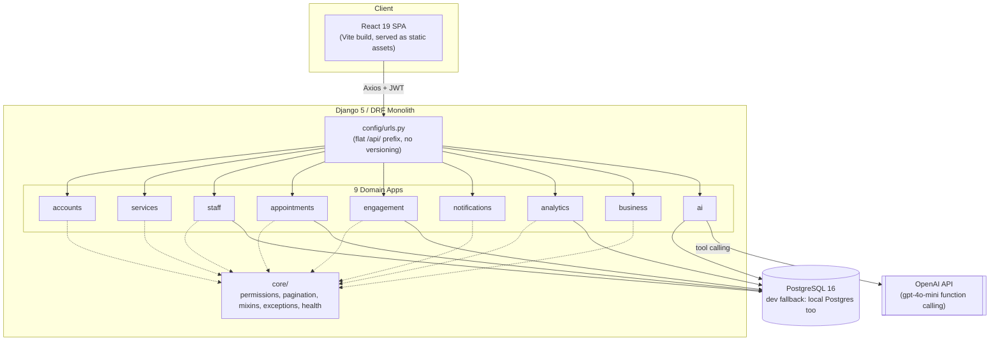
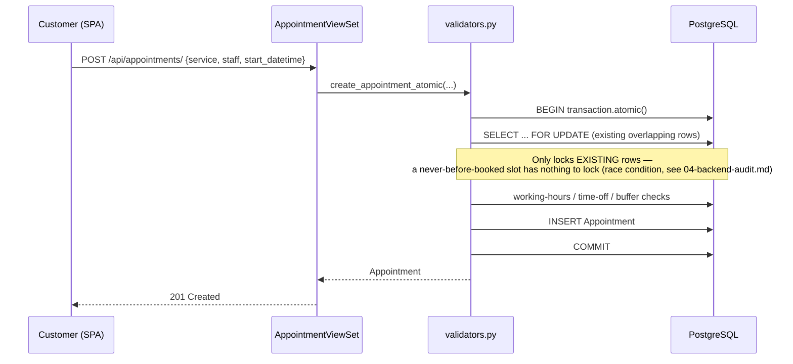
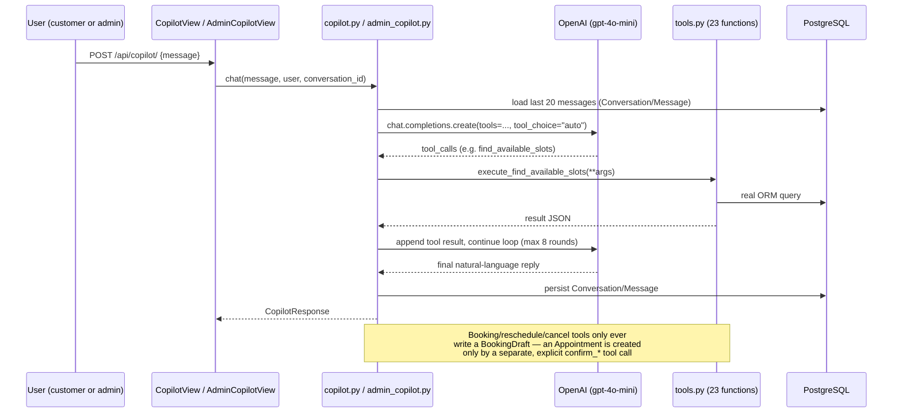
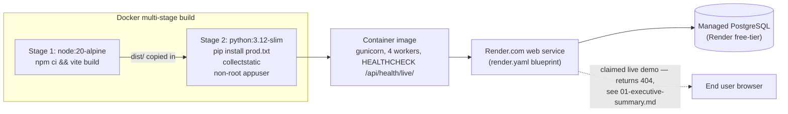

# 05 — System Architecture Audit

> **Current-state addendum (commit `25ad7e6`):** The modular-monolith classification and diagrams remain valid, except the AI provider is now **Google Gemini via `apps/ai/gemini_client.py`**, not OpenAI. The target architecture should keep this modular monolith. Highest-value boundary work remains extracting analytics/selectors, generating TypeScript DTOs from OpenAPI, moving durable notification/webhook retries to a worker only if operational need justifies it, and wiring the existing AI observability boundary. Microservices are not recommended.

## Classification

This is a **modular monolith** — a well-organized Django project split into 9 domain apps (`accounts`, `services`, `staff`, `appointments`, `engagement`, `notifications`, `analytics`, `business`, `ai`) plus a `core` shared-utilities module, served alongside a separately-built React SPA. It is not microservices, and it should not become microservices — the scale and team size (solo developer, portfolio demo) does not justify that complexity. The classification is: **modular monolith, inconsistently enforced** — some domains have a real service/selector layer (`ai`, `staff`, `appointments/validators.py`, `engagement/services.py`, `notifications`), others still have business logic embedded directly in views (`analytics`, `reviews`, `loyalty` balance calculation). No `selectors.py` pattern exists anywhere in the repo.

## Domain separation table

| Domain | Owning app | Service/selector layer? | Notes |
|---|---|---|---|
| accounts | `apps/accounts` | No (thin views, acceptable) | |
| business (multi-tenant) | `apps/business` | Yes — `core/business.py` + `core/mixins.py` (`BusinessScopedMixin`) | Cleanest cross-cutting pattern in the codebase, though inconsistently applied (see backend audit isolation gaps) |
| services (catalog) | `apps/services` | No dedicated module (simple CRUD, acceptable) | |
| staff / availability | `apps/staff` | Yes — `apps/staff/services.py` (`get_available_slots`) | |
| bookings/appointments | `apps/appointments` | Yes — `validators.py` (conflict checks, atomic create/update) | Status-transition logic still lives in the viewset actions rather than a service function |
| promotions | `apps/engagement` | Yes — `apps/engagement/services.py`, reused across apps | |
| loyalty | `apps/engagement` | No — balance calc is a module-level function directly in `views.py` | Inconsistent with promotions in the same app |
| reviews | `apps/engagement` | No — plain CRUD in views | |
| notifications | `apps/notifications` | Yes — `services.py` + signal-driven creation | |
| analytics | `apps/analytics` | No — all aggregation logic lives directly in views | Heaviest concentration of business logic inside views in the whole codebase |
| ai | `apps/ai` | Yes, extensively | Best-separated module by far (`copilot.py`, `tools.py`, `recommender.py`, `no_show.py`, `revenue_forecast.py`, `evaluation.py`, `observability.py`) |

## Current architecture diagram

## Request/data-flow diagram (booking creation)

## AI request-flow diagram

## Deployment architecture diagram

## Recommended target architecture

For a portfolio demo, the current modular-monolith shape is **already correct** — do not recommend microservices. The realistic improvements are:

1. Finish wiring `IsBusinessAdmin`/`IsBusinessMember` (already built, unused) into every business-owned viewset, closing the isolation gaps identified in the backend audit.
2. Add a thin `selectors.py`/`services.py` to `apps/analytics` and extract loyalty-balance/review logic out of `views.py` in `apps/engagement`, for consistency with the pattern already used in `apps/ai`, `apps/staff`, and `apps/appointments`.
3. Add a Postgres exclusion constraint (or a unique constraint on a normalized slot key) as a DB-level backstop for booking conflicts, rather than relying solely on application-level locking.
4. Consider generating frontend TypeScript types from the drf-spectacular OpenAPI schema (already produced at `/api/schema/`) instead of the current fully-manual duplication of ~21 interfaces in `client.ts`, to remove a silent-drift risk.

This remains a clean, realistic modular monolith after these fixes — no additional services or infrastructure complexity is warranted.
